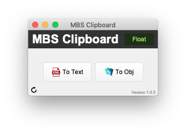

# MBS Clipboard

Converting FM objects to XML and back.

## Features

- Converts any FM object that can be copied:
  - Script Steps
  - Scripts
  - Tables
  - Fields
  - Layout Objects
  - ValueLists
  - Custom Functions
- Optionally floats above other windows for easy access

## Requirements

- [MBS FileMaker Plug-in](https://www.monkeybreadsoftware.de/filemaker/)
